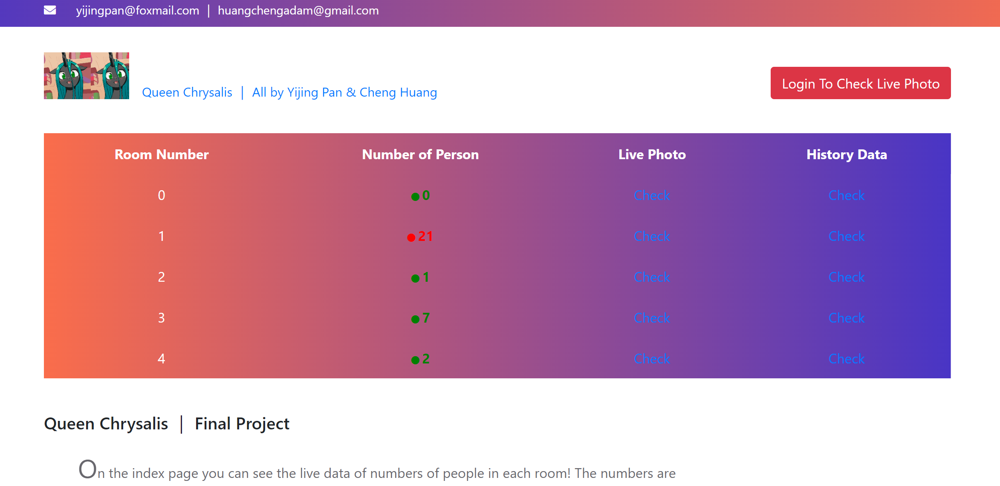
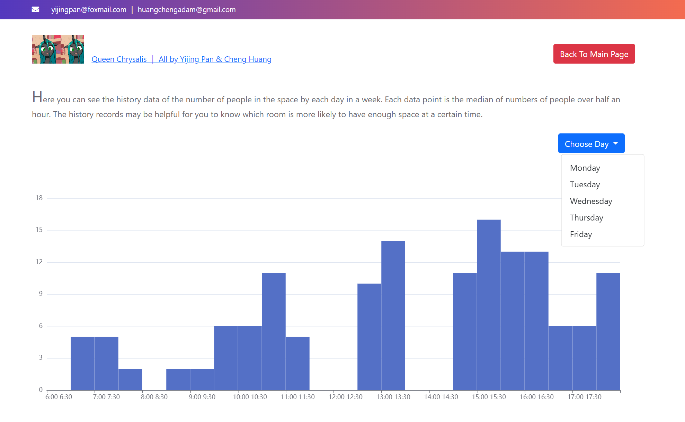

# StudySpaceMonitoring

Study Space Occupancy Monitoring -- Project for the course Building the Internet of Things with P2P and Cloud Computing.

A prototype system based on Raspberry Pi, utilizing a deep learning approach combined with camera video feeds to estimate number of people in certain study spaces and providing live and historical information of study space occupancy to users.

Authors: Yijing Pan, Cheng Huang

Main techs/libs used in this project:
- Backend: Flask
- Frontend: Bootstrap, Axios
- Camera: Pi camera model v2
- DeepLearning/Image Recoginition: TensorFlow Lite
- Mqtt: Paho.mqtt (for Python), Mosquitto, Flask_mqtt

We only have one camera when we did this project :) So in this project we used two video sources: a Pi-camera model V2 for real-time vedio feed, and a pre-record vedio. And in the database there are already some synthetic data records, for showing some functionanlities (such as showing history data).


Cloud component url: queenchrysalisproject.northeurope.azurecontainer.io

Note: it is disabled, because I ran out my free credits on Azure so I can't keep it running 24/7. If you want to have a look please contact me so that I can lauch it for a short time.

# Branches:

- branch `main` : Codes that should run on RPi. Note that in this branch one of the mqtt clients needs to connect and send data to the broker on cloud, but unfortunately because I ran out my credits on Azure (where I deploy the broker and other cloud component) I can not keep the cloud broker always running. So if you clone this repo you can't directly run it, instead you need to first change the configuration of the client (`c_cloud` in `publisher\cam.py`) which needs to connect to a cloud broker to make it connect to your own cloud broker.

- branch `cloud_component`: Codes for cloud components, running on cloud (or on another PC that does not neccesarily has access to your RPi). Note that in this branch the client (we just use flask_mqtt here) in `app.py` need to connect and send/receive data to the broker on cloud, but I can not keep the cloud broker always running. So if you clone this repo you can't directly run it, instead you need to change the configuration of the mqtt client connection to make it connect to your own cloud broker.


- branch `pure_local` : This was the first stage of our project. In this branch, everything runs locally, all clients only connect to the local broker but not the cloud broker. You should be able to run this directly on your RPi.


# Set up for this branch.

Make sure that the Pi camera is connected to your RPi, and change the configuration of the client (`c_cloud` in `publisher\cam.py`) which needs to connect to a cloud broker to make it connect to your own cloud broker.

### 1. Install python denpendencies

```shell
$ pip3 install argparse
$ pip3 install numpy==1.21.0
$ pip3 install opencv-python~=4.5.3.56
$ pip3 install tflite-runtime==2.5.0
$ pip3 install datetime
$ pip3 install flask
$ pip3 install flask-mqtt
$ pip3 install paho-mqtt
```

(We tried to wrap every component respectively into a docker image to and to use docker compose to run them together. However we didn't make it due to some errors with installing  some denpendencies into a docker image)

### 2. Clone this repo and go to the root directory

```shell
$ git clone https://gitlab.au.dk/au671364/studyspacemonitoring.git
$ cd studyspacemonitoring
```

### 3. build the local broker docker image and run it

From the root directory of this repo

```shell
$ cd mqtt 
$ docker build -t localbroker .
$ docker run -p 1883:1883 localbroker
```

### 4. Run camera and deeplearning for people detection components

From the root directory of this repo

```shell
$ cd publisher
$ python3 cam.py
```

### 5. Run the flask application (backend+frontend)

From the root directory of this repo

```shell
$ python3 app.py
```


Then visit `localhost:8080`

### Some screenshots



